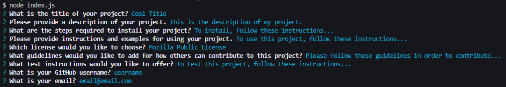
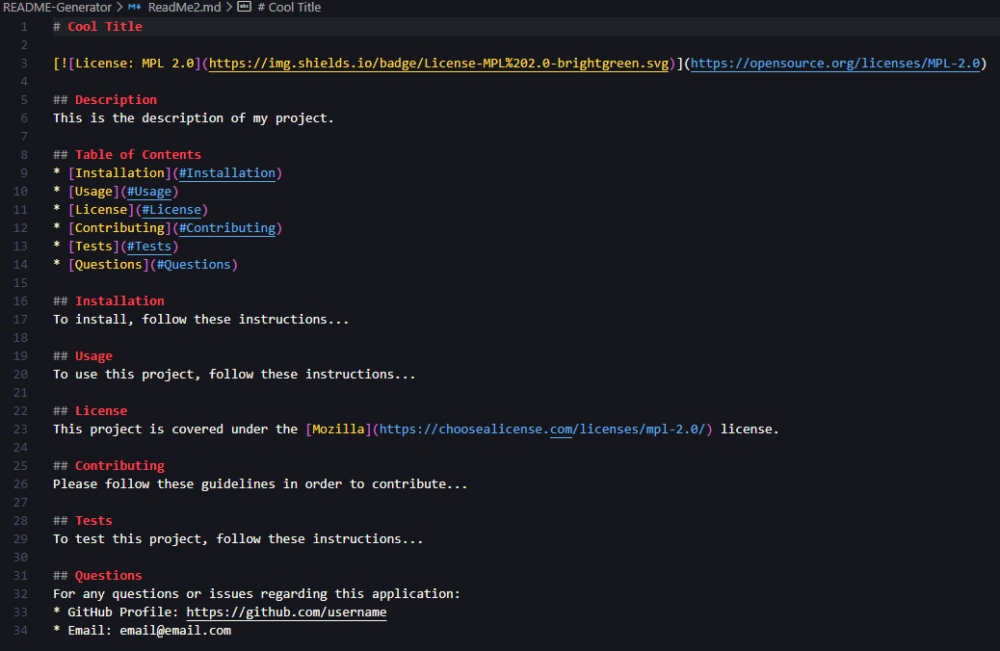

# README-Generator

## Table of Contents
* [Description](#Description)
* [Links](#Links)
* [Design Elements](#Design-Elements)
* [App Preview](#App-Preview)
* [Credits](#Credits)

## Description
This is a command-line application that dynamically generates a professional README.md based on the user's input. A README is fundamental to helping the user understand everything one needs to know in order to use a website properly. This application enables developers to spend more time on their own applications rather than on creating a professional README.

### *Usage*
1. Enter "node index.js" in your command line.
2. Enter your project's information based on the prompts.
3. Look for the new README.md file that will be created.

## Links
* Video Walkthrough: https://drive.google.com/file/d/1sKxHpUbq1w7AnPvsmmEihmjxHFfcMpuU/view
* GitHub Repository: https://github.com/zachdrummond/README-Generator

## Design Elements
* JavaScript
* Node.js
* Node Package Manager - Inquirer
* Command-Line User Interface

## App Preview
### Command-Line Instructions

### ReadMe

## Credits
* https://nodejs.org/en/
* https://www.npmjs.com/package/inquirer
